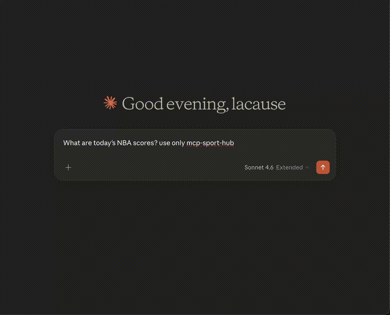

<p align="center">
  
</p>

<h1 align="center">Sports Hub MCP Server</h1>

<p align="center">
  <a href="https://www.npmjs.com/package/mcp-sports-hub"></a>
  <a href="https://www.npmjs.com/package/mcp-sports-hub"></a>
  <a href="https://github.com/lacausecrypto/mcp-sports-hub/actions"></a>
  <a href="LICENSE"></a>
</p>

<p align="center">
  
  
  <a href="https://registry.modelcontextprotocol.io"></a>
</p>

<p align="center">
  
  
  
  
  
</p>

A unified MCP server that aggregates **41 sports API providers** into a single service. **396 tools** covering scores, stats, odds, esports, college sports, chess, motorsport, boxing, AFL, and more across 70+ sports.

> Each provider works independently. You only need API keys for the providers you use. Missing keys don't block startup — tools return an error when called without their key.

**Works with:**
[](https://claude.ai)
[](https://openai.com)
[](https://cursor.com)
[](https://codeium.com/windsurf)
[](https://zed.dev)
[](https://continue.dev)
[](https://github.com/cline/cline)

## Demo



> NBA scores, Premier League odds, Tennis H2H — all from a single MCP server.

## Compatibility

### Platforms

| OS | Status |
|----|--------|
| macOS | Supported |
| Linux | Supported |
| Windows | Supported |

### MCP Clients

| Client | Status | Notes |
|--------|--------|-------|
| **Claude Desktop** | Supported | Anthropic's desktop app |
| **Claude Code (CLI)** | Supported | `claude mcp add` |
| **Cursor** | Supported | Built-in MCP |
| **Windsurf (Codeium)** | Supported | Built-in MCP |
| **Continue.dev** | Supported | Open-source AI assistant |
| **Cline** | Supported | VS Code extension |
| **Zed** | Supported | Built-in MCP |
| **ChatGPT Desktop** | Supported | OpenAI desktop app |
| **Gemini CLI** | Supported | Google CLI |
| **Any MCP client** | Supported | Stdio + HTTP/SSE transport |

Uses the **stdio transport** from the [MCP SDK](https://modelcontextprotocol.io). Works with any LLM (Claude, GPT, Gemini, Llama, Mistral, etc.).

**Requirements**: Node.js 18+, npm.

## Providers (32)

### Works instantly — no API key, no signup (19 providers, ~165 tools)

These providers work out of the box. Just build and run.

| Prefix | Provider | Coverage | Tools | Notes |
|--------|----------|----------|-------|-------|
| `espn_` | [ESPN](https://site.api.espn.com/) | 20+ sports | 10 | Unofficial — can break |
| `nhl_` | [NHL Web API](https://api-web.nhle.com/) | NHL | 13 | Undocumented but stable |
| `mlb_` | [MLB Stats API](https://statsapi.mlb.com/) | MLB/MiLB | 13 | Official, undocumented |
| `f1_` | [Jolpica F1](https://api.jolpi.ca/ergast/f1/) | Formula 1 (1950+) | 13 | Community-maintained |
| `openf1_` | [OpenF1](https://openf1.org/) | F1 live telemetry | 12 | Live race weekends only |
| `openliga_` | [OpenLigaDB](https://api.openligadb.de/) | German football | 10 | Bundesliga focus |
| `sportsdb_` | [TheSportsDB](https://www.thesportsdb.com/) | 40+ sports | 13 | Test key auto, watermarks |
| `ncaa_` | [NCAA API](https://github.com/henrygd/ncaa-api) | College sports | 8 | 5 req/s rate limit |
| `sportsrc_` | [SportSRC](https://sportsrc.org/) | Football, basketball, MMA + streams | 7 | V1 free, V2 needs paid key |
| `lichess_` | [Lichess](https://lichess.org/api) | Chess (users, top players, broadcasts, daily puzzle) | 7 | ~20 req/sec/IP |
| `chesscom_` | [Chess.com](https://www.chess.com/news/view/published-data-api) | Chess (profiles, stats, clubs, leaderboards) | 7 | Throttles on parallel calls |
| `squiggle_` | [Squiggle](https://api.squiggle.com.au/) | AFL (Australian Football League) | 6 | Honest UA required |
| `motogp_` | [MotoGP](https://www.motogp.com/) | MotoGP/Moto2/Moto3/MotoE | 7 | Unofficial — can break |
| `formulae_` | [Formula E](https://www.fiaformulae.com/) | Formula E | 7 | Unofficial — can break |
| `nascar_` | [NASCAR](https://www.nascar.com/) | NASCAR Cup/Xfinity/Truck | 3 | Unofficial CDN feeds |
| `opendota_` | [OpenDota](https://www.opendota.com/) | Dota 2 analytics | 11 | 60 req/min, 50k/mo |
| `sleeper_` | [Sleeper](https://docs.sleeper.com/) | NFL fantasy | 10 | ~1000 req/min |
| `euroleague_` | [EuroLeague](https://www.euroleaguebasketball.net/) | EuroLeague + EuroCup basketball | 6 | Keyless feeds |
| `footballdata_uk_` | [Football-Data.co.uk](https://www.football-data.co.uk/) | Historical football results + odds | 2 | CSV, 25+ leagues |

> **Tip**: Use `SPORTS_HUB_PROVIDERS=free` to load only these 19 providers (~165 tools).

### Free tier with API key — signup required, no credit card (22 providers, ~231 tools)

Registration takes 1-2 minutes. All keys are free.

| Prefix | Provider | Coverage | Tools | Free Limit | Get Key |
|--------|----------|----------|-------|------------|---------|
| `pandascore_` | PandaScore | Esports (13 titles) | 14 | 1000 req/hr | [Sign up](https://pandascore.co/) |
| `apifootball_` | API-Football | Soccer (960+ leagues) | 15 | 100 req/day | [Sign up](https://www.api-football.com/) |
| `apisports_` | API-Sports | 9 sports | 10 | 100 req/day/sport | [Sign up](https://api-sports.io/) |
| `apitennis_` | API-Tennis | Tennis (ATP/WTA/ITF) | 12 | 100 req/day | [Sign up](https://api-tennis.com/) |
| `bdl_` | BallDontLie | NBA/NFL/MLB/NHL | 10 | Basic tier | [Sign up](https://www.balldontlie.io/) |
| `cricket_` | CricketData | Cricket | 10 | 100 req/day | [Sign up](https://cricketdata.org/) |
| `entitycricket_` | Entity Sport | Cricket (250+ comps) | 12 | Free plan | [Sign up](https://www.entitysport.com/) |
| `footballdata_` | football-data.org | Soccer (12 leagues) | 11 | 10 req/min | [Sign up](https://www.football-data.org/) |
| `sportmonks_` | Sportmonks | Soccer | 12 | 3000 req/hr | [Sign up](https://www.sportmonks.com/) |
| `sportsdata_` | SportsDataIO | 9 sports | 12 | 1000 req/mo | [Sign up](https://sportsdata.io/) |
| `odds_` | The Odds API | 70+ sports odds | 9 | 500 req/mo | [Sign up](https://the-odds-api.com/) |
| `oddsio_` | Odds-API.io | 34 sports odds | 10 | Free account | [Sign up](https://odds-api.io/) |
| `sgo_` | Sports Game Odds | 55+ leagues odds | 10 | Trial | [Sign up](https://sportsgameodds.com/) |
| `mma_` | Fighting Tomatoes | MMA | 8 | 200 req/mo | [Sign up](https://fightingtomatoes.com/) |
| `livegolf_` | Live Golf API | Golf (PGA/DP World) | 8 | Free tier | [Sign up](https://livegolfapi.com/) |
| `isports_` | iSportsAPI | Football/Basketball (Asia) | 10 | Free tier | [Sign up](https://www.isportsapi.com/) |
| `sportdevs_` | SportDevs | Rugby/Volleyball/Handball | 12 | Trial | [Sign up](https://sportdevs.com/) |
| `msf_` | MySportsFeeds | NFL/NBA/MLB/NHL | 12 | Free non-commercial | [Sign up](https://www.mysportsfeeds.com/) |
| `golfcourse_` | GolfCourseAPI | 30K+ golf courses | 6 | 300 req/day | [Sign up](https://golfcourseapi.com/) |
| `cfbd_` | College Football Data | NCAA football | 14 | 1000 req/mo | [Sign up](https://collegefootballdata.com/key) |
| `boxing_` | Boxing Data API | Pro boxing (fighters/bouts/titles) | 8 | 100 req/mo | [Sign up](https://rapidapi.com/) |
| `highlightly_` | Highlightly | Multi-sport highlights + odds | 6 | 100 req/day | [Sign up](https://highlightly.net/) |

> Providers with missing keys don't block the server — they just return an error when called. Register keys incrementally as you need them.

## Installation

### Quick (npx — no install)

```bash
npx mcp-sports-hub
```

### npm global

```bash
npm install -g mcp-sports-hub
mcp-sports-hub
```

### From source

```bash
git clone https://github.com/lacausecrypto/mcp-sports-hub.git
cd mcp-sports-hub
npm install
npm run build
```

### MCP Registry

This server is published on the [official MCP Registry](https://registry.modelcontextprotocol.io) as `io.github.lacausecrypto/sports-hub`. MCP clients that support the registry can discover and install it automatically.

## Transport Modes

### Stdio (default — Claude Desktop, Cursor, etc.)

```bash
npx mcp-sports-hub
```

### HTTP/SSE (remote clients, web apps, custom integrations)

```bash
# Via flag
npx mcp-sports-hub --http

# Via env
SPORTS_HUB_HTTP=1 SPORTS_HUB_PORT=3000 npx mcp-sports-hub
```

Endpoints:
- `POST /mcp` — MCP protocol (Streamable HTTP with SSE)
- `GET /health` — Health check (`{"status":"ok","providers":19}`)

Supports CORS, session management via `mcp-session-id` header. Default port: 3000.

> **⚠ Security**: HTTP mode binds to `127.0.0.1` (loopback) by default. Setting `SPORTS_HUB_HOST=0.0.0.0` exposes an **unauthenticated** MCP endpoint to your whole network — anyone who can reach it can use your configured API keys. DNS-rebinding protection only blocks browser-origin attacks, not direct clients. Only expose it behind a reverse proxy with auth/TLS. `SPORTS_HUB_CORS_ORIGINS` must list explicit origins (a literal `*` is rejected).

## Configuration

### Environment Variables

Only set keys for providers you want:

```bash
# Free — no key needed:
# ESPN, NHL, MLB, Jolpica F1, OpenF1, OpenLigaDB, NCAA, TheSportsDB (test key),
# SportSRC (V1), Lichess, Chess.com, Squiggle (AFL),
# MotoGP, Formula E, NASCAR, OpenDota, Sleeper

# Optional (defaults to test key)
export THESPORTSDB_API_KEY="your-key"          # https://www.thesportsdb.com/

# Requires free registration
export PANDASCORE_TOKEN="your-token"            # https://pandascore.co/
export API_SPORTS_KEY="your-key"                # https://api-sports.io/
export API_FOOTBALL_KEY="your-key"              # https://www.api-football.com/
export API_TENNIS_KEY="your-key"                # https://api-tennis.com/
export BALLDONTLIE_API_KEY="your-key"           # https://www.balldontlie.io/
export CRICKETDATA_API_KEY="your-key"           # https://cricketdata.org/
export ENTITY_SPORT_KEY="your-key"              # https://www.entitysport.com/
export FOOTBALL_DATA_API_KEY="your-key"         # https://www.football-data.org/
export SPORTMONKS_API_KEY="your-key"            # https://www.sportmonks.com/
export SPORTSDATA_IO_KEY="your-key"             # https://sportsdata.io/
export THE_ODDS_API_KEY="your-key"              # https://the-odds-api.com/
export ODDS_API_IO_KEY="your-key"               # https://odds-api.io/
export SPORTS_GAME_ODDS_KEY="your-key"          # https://sportsgameodds.com/
export FIGHTING_TOMATOES_API_KEY="your-key"     # https://fightingtomatoes.com/
export LIVE_GOLF_API_KEY="your-key"             # https://livegolfapi.com/
export ISPORTSAPI_KEY="your-key"                # https://www.isportsapi.com/
export SPORTDEVS_API_KEY="your-key"             # https://sportdevs.com/
export GOLFCOURSE_API_KEY="your-key"            # https://golfcourseapi.com/
export MYSPORTSFEEDS_USER="your-user"           # https://www.mysportsfeeds.com/
export MYSPORTSFEEDS_PASS="your-pass"
export CFBD_API_KEY="your-key"                  # https://collegefootballdata.com/key
```

**Windows** (PowerShell):
```powershell
$env:API_SPORTS_KEY = "your-key"
$env:PANDASCORE_TOKEN = "your-token"
```

**Windows** (cmd):
```cmd
set API_SPORTS_KEY=your-key
set PANDASCORE_TOKEN=your-token
```

### Claude Desktop

Config file locations:
- **macOS**: `~/Library/Application Support/Claude/claude_desktop_config.json`
- **Windows**: `%APPDATA%\Claude\claude_desktop_config.json`
- **Linux**: `~/.config/claude/claude_desktop_config.json`

```json
{
  "mcpServers": {
    "sports-hub": {
      "command": "node",
      "args": ["/absolute/path/to/mcp-sports-hub/dist/index.js"],
      "env": {
        "PANDASCORE_TOKEN": "your-token",
        "API_SPORTS_KEY": "your-key",
        "THE_ODDS_API_KEY": "your-key"
      }
    }
  }
}
```

Windows path: `"args": ["C:/Users/you/mcp-sports-hub/dist/index.js"]`

Only include env vars for providers you need. Omit `env` entirely for free-only providers.

### Claude Code (CLI)

```bash
claude mcp add sports-hub node /absolute/path/to/mcp-sports-hub/dist/index.js
```

Or in `.claude/settings.json`:
```json
{
  "mcpServers": {
    "sports-hub": {
      "command": "node",
      "args": ["/absolute/path/to/mcp-sports-hub/dist/index.js"],
      "env": {
        "PANDASCORE_TOKEN": "your-token"
      }
    }
  }
}
```

## Provider Filtering

By default, only the **free preset** is loaded (19 providers, ~165 tools — no API keys needed). Use `SPORTS_HUB_PROVIDERS` to change what's loaded:

```bash
# Default — free providers only (no config needed)
npx mcp-sports-hub

# Load ALL 41 providers (396 tools)
SPORTS_HUB_PROVIDERS=all npx mcp-sports-hub

# Use a preset
SPORTS_HUB_PROVIDERS=us-major npx mcp-sports-hub

# Pick specific providers
SPORTS_HUB_PROVIDERS=espn,nhl,odds npx mcp-sports-hub

# Exclude from all (prefix with -)
SPORTS_HUB_PROVIDERS=-sportsdata,-mma npx mcp-sports-hub
```

### Presets

| Preset | Providers | Tools | Needs keys? |
|--------|-----------|-------|-------------|
| `free` (default) | 19 no-key providers (espn, nhl, mlb, f1, openf1, openliga, sportsdb, ncaa, sportsrc, lichess, chesscom, squiggle, motogp, formulae, nascar, opendota, sleeper, euroleague, footballdatauk) | ~165 | No |
| `all` | all 41 providers | 396 | Yes (for key-required providers) |
| `chess` | lichess, chesscom | 14 | No |
| `us-major` | espn, nhl, mlb, ncaa, cfbd, bdl, msf, nascar, sleeper | ~93 | Some |
| `soccer` | espn, apifootball, footballdata, sportmonks, openliga, sportsrc, footballdatauk, highlightly | ~73 | Some |
| `f1` | f1, openf1 | 25 | No |
| `motorsport` | f1, openf1, motogp, formulae, nascar | ~42 | No |
| `esports` | pandascore, opendota | 25 | Some |
| `odds` | odds, oddsio, sgo | 29 | Yes |
| `cricket` | cricket, entitycricket | 22 | Yes |
| `golf` | livegolf, golfcourse | 14 | Some |

### Cache

All GET responses are cached in memory for 60 seconds by default. This protects against duplicate calls and rate limit waste. Configure with:

```bash
SPORTS_HUB_CACHE_TTL=120  # seconds (0 to disable)
```

In Claude Desktop config:
```json
"env": {
  "SPORTS_HUB_PROVIDERS": "us-major",
  "THE_ODDS_API_KEY": "your-key"
}
```

## Tool Naming

All tools follow `{provider}_{action}`:

```
espn_get_scoreboard        — Live scores (ESPN)
nhl_get_standings          — NHL standings
mlb_get_game_boxscore      — MLB box score
f1_get_race_results        — F1 results (1950+)
openf1_get_laps            — F1 live telemetry
pandascore_get_lives       — Live esports matches
apifootball_get_fixtures   — Soccer fixtures (960+ leagues)
odds_get_odds              — Betting odds (70+ sports)
sportsrc_get_xg_stats      — Expected goals (xG)
```

## MCP Resources & Prompts

Beyond tools, the server exposes:

**Resources** (readable catalogs, no API call):
- `sportshub://providers` — the full provider catalog (prefix, name, coverage, required key)
- `sportshub://presets` — all presets and the providers they load
- `sportshub://provider/{key}` — details for one provider (with key autocompletion)

**Prompts** (curated slash-command workflows over the 396 tools):
- `whats-on-today` · `compare-odds {event}` · `motorsport-weekend {series}` · `league-standings {league}` · `team-deep-dive {team}` · `f1-race {season} {round}`

All tools are annotated `readOnly` / `idempotent` so clients can skip confirmation prompts.

## Architecture

```
src/
├── index.ts                    # Imports + registers all 41 providers
├── shared/
│   ├── http.ts                 # fetchJson, fetchText, buildUrl, toolResult, errorResult
│   ├── catalog.ts              # provider catalog + presets (single source of truth)
│   ├── annotations.ts          # central read-only annotations + titles
│   ├── resources.ts            # MCP resources (provider/preset catalogs)
│   └── prompts.ts              # MCP prompts (curated workflows)
└── providers/
    ├── espn.ts                 #  10 tools — no key
    ├── nhl.ts                  #  13 tools — no key
    ├── mlb-stats.ts            #  13 tools — no key
    ├── jolpica-f1.ts           #  13 tools — no key
    ├── openf1.ts               #  12 tools — no key
    ├── openligadb.ts           #  10 tools — no key
    ├── golfcourse.ts           #   6 tools — GOLFCOURSE_API_KEY
    ├── thesportsdb.ts          #  13 tools — optional key
    ├── pandascore.ts           #  14 tools — PANDASCORE_TOKEN
    ├── api-football.ts         #  15 tools — API_FOOTBALL_KEY
    ├── api-sports.ts           #  10 tools — API_SPORTS_KEY
    ├── api-tennis.ts           #  12 tools — API_TENNIS_KEY
    ├── balldontlie.ts          #  10 tools — BALLDONTLIE_API_KEY
    ├── cricketdata.ts          #  10 tools — CRICKETDATA_API_KEY
    ├── entity-sport-cricket.ts #  12 tools — ENTITY_SPORT_KEY
    ├── football-data.ts        #  11 tools — FOOTBALL_DATA_API_KEY
    ├── sportmonks.ts           #  12 tools — SPORTMONKS_API_KEY
    ├── sportsdata-io.ts        #  12 tools — SPORTSDATA_IO_KEY
    ├── the-odds-api.ts         #   9 tools — THE_ODDS_API_KEY
    ├── odds-api-io.ts          #  10 tools — ODDS_API_IO_KEY
    ├── sports-game-odds.ts     #  10 tools — SPORTS_GAME_ODDS_KEY
    ├── fighting-tomatoes.ts    #   8 tools — FIGHTING_TOMATOES_API_KEY
    ├── live-golf.ts            #   8 tools — LIVE_GOLF_API_KEY
    ├── isportsapi.ts           #  10 tools — ISPORTSAPI_KEY
    ├── sportdevs.ts            #  12 tools — SPORTDEVS_API_KEY
    ├── mysportsfeeds.ts        #  12 tools — MYSPORTSFEEDS_USER/PASS
    ├── sportsrc.ts             #   7 tools — V1 free, V2 needs paid key (not exposed)
    ├── ncaa.ts                 #   8 tools — no key
    ├── cfbd.ts                 #  14 tools — CFBD_API_KEY
    ├── lichess.ts              #   7 tools — no key
    ├── chess-com.ts            #   7 tools — no key
    ├── squiggle.ts             #   6 tools — no key
    ├── motogp.ts               #   7 tools — no key
    ├── formula-e.ts            #   7 tools — no key
    ├── nascar.ts               #   3 tools — no key
    ├── opendota.ts             #  11 tools — no key
    ├── sleeper.ts              #  10 tools — no key
    ├── euroleague.ts           #   6 tools — no key
    ├── football-data-uk.ts     #   2 tools — no key (CSV)
    ├── boxing.ts               #   8 tools — BOXING_DATA_API_KEY
    └── highlightly.ts          #   6 tools — HIGHLIGHTLY_API_KEY
```

Each provider exports `register(server)`. Keys are checked at call time, not startup.

## Contributing

1. Fork the repository
2. Create `src/providers/my-api.ts` exporting `register(server: McpServer)`
3. Prefix tool names: `myapi_get_something`
4. Import + call in `src/index.ts`
5. `npm run build` to verify
6. Submit a PR

## License

MIT
